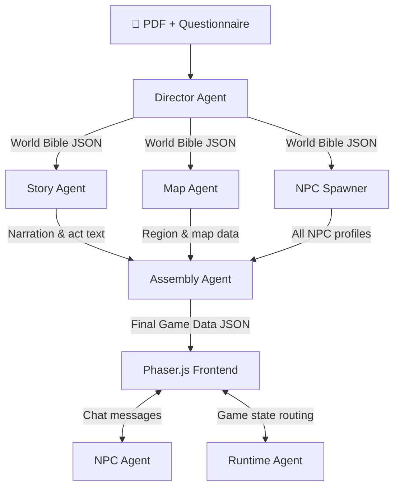

# Paper RPG

**Turn any academic paper into a playable open-world RPG.**

Upload a research PDF, answer a short questionnaire, and a multi-agent AI pipeline automatically generates a game world — complete with lore, NPCs, quests, and a map — themed entirely around the paper's ideas. Explore the world, recruit scholar NPCs by understanding their concepts, pass region quizzes, and ultimately prove your comprehension to the author NPC.

> Demo paper: Vaswani et al., *"Attention Is All You Need"* (2017)

---

## Architecture



Story Agent and Map Agent run **in parallel** via `asyncio.gather`. NPC Spawner generates all NPCs **in parallel** as well.

---

## Multi-Agent Design

The core design principle: each agent has a single responsibility and a bounded output contract. No agent sees more context than it needs.

### Generation Pipeline (runs once on upload)

| Agent | Input | Output | Notes |
|-------|-------|--------|-------|
| **Director** | Full paper text + questionnaire | World Bible JSON | Two-step: free-form analysis → structured JSON extraction. Most capable model, highest quality budget. |
| **Story Agent** | World Bible summary | Act narrations, atmosphere text | Runs in parallel with Map Agent |
| **Map Agent** | World Bible summary (not raw bible — prevents model confusion) | Region definitions, exploration spots, NPC placements | Structured summary passed, not raw world bible |
| **NPC Spawner** | World Bible + per-NPC spec | Full NPC profile per character | All NPCs generated in parallel; each call is independent |
| **Assembly Agent** | All outputs above | Final Game Data JSON | Programmatic consistency fix (`_fix_npc_consistency`) + LLM coherence pass |

### Runtime (per player action)

| Agent | Role |
|-------|------|
| **NPC Agent** | Stateless dialogue engine. Receives full NPC profile + conversation history + player context on every call. Outputs structured JSON: `reply`, `task_complete`, `task_given`, `item_given`. |
| **Runtime Agent** | Routes player actions to the correct NPC agent, maintains game state summary passed to each call |

### World Bible

The Director Agent produces a **World Bible** — the shared contract between all downstream agents. Key fields:

- `world.fundamental_conflict` — the paper's core problem, dramatized as a world-level crisis
- `acts[]` — one act per paper section, each with area type, quests, and exploration spots
- `npcs[]` — typed NPC specs: **A** (cited prior work), **B** (core paper concepts), **C** (paper authors)
- `boss` — antagonist representing the baseline/prior method the paper defeats
- `author_npc` — final examiner NPC with graded exam questions

---

## NPC Types

| Type | Represents | Quantity | Behavior |
|------|-----------|----------|----------|
| **A — Reference NPC** | Cited prior works | 3–8 | Knowledge limited to their era; half-aware of later developments |
| **B — Concept NPC** | Core paper concepts/components | 3–6 | Deep self-knowledge; recruited only after player demonstrates understanding |
| **C — Author NPC** | Paper authors | 1 | Knows everything; appears in the final act; gives layered feedback, never says "wrong" |

---

## Quest System

Three quest types, each requiring different player actions:

- **Knowledge quest** — engage in dialogue until the NPC judges your understanding sufficient
- **Delivery quest** — recruit NPC B to receive a Knowledge Crystal, then bring it back to NPC A
- **Exploration quest** — find a named location on the map, examine the site (first E), pick up the ruin item (second E), return it to the quest giver

Recruited NPCs appear as hint-givers during region exit quizzes — the more you recruit, the more hints you get.

---

## Tech Stack

| Layer | Technology |
|-------|-----------|
| Backend | Python 3.11, FastAPI, asyncio |
| LLM | DeepSeek API (`deepseek-chat`); client abstraction supports OpenAI / Claude / Gemini |
| PDF parsing | pdfplumber (first ~60k characters) |
| Streaming | SSE (Server-Sent Events) for generation progress |
| Frontend | React 18, Vite |
| Game engine | Phaser.js 3 (Arcade Physics, tile-based map) |
| Map generation | Seeded procedural generation (per area type) |
| Deployment | Railway (Docker two-stage build: Node → Python) |

---

## Current Limitations

- **Delivery and exploration quests** need further strengthening — submission flow and item matching can be more robust
- **Boss battle not implemented** — world bible generates boss data (`battle_mechanic`, `weakness`) but no frontend UI exists yet
- **Only 1 interactive exploration spot per region** — the map generator places limited ruin objects; density needs to increase
- **Map layout is not paper-specific** — procedural generation uses area theme (ruins, forge, library…) but tile arrangement does not reflect the paper's actual structure or concepts
- **Only engineering/methods papers fully supported** — the director and NPC prompt logic is optimized for method-driven papers; theory, survey, and system papers need dedicated prompt templates
- **No game progress persistence** — refreshing the page loses all state (chat histories, recruited NPCs, inventory); game state lives in React memory only
- **NPC loading is eager** — all NPCs for all regions are generated upfront; later regions block the loading screen even if the player won't reach them for a while

---

## Roadmap

### Near-term

- **Boss battle UI** — implement the boss encounter screen keyed to `world_bible.boss.battle_mechanic`; support all four forms: `combat`, `debate`, `puzzle`, `construction`
- **Author NPC exam flow** — dedicated exam UI for C-type NPCs; multi-tier scoring based on answer quality; hints from recruited B-type NPCs
- **Progressive NPC loading** — restructure NPC Spawner to generate by region; SSE pushes per-region readiness; players enter after region 1 is ready while later regions load in the background
- **Increase exploration spot density** — 3–5 interactive spots per region; each spot with its own atmospheric inscription and lootable concept item
- **Area theme decorations** — static decoration layer per area type (library → bookshelves + candles; forge → anvils + furnaces; ruins → broken walls + inscribed stones)

### Medium-term

- **Caching system** — cache the Director Agent output (paper understanding layer) so the same paper can be re-entered instantly; re-run world generation layer each time to produce a different game world from the same paper
- **Paper type routing** — classification agent detects paper type (method / theory / system / survey) and routes to type-specific director and NPC prompt templates
- **Map style: Stardew Valley pixel art** — replace current colored tile renderer with LPC (Liberated Pixel Cup) sprite assets; 4-direction character walk animation; camera follow
- **Non-linear region unlocking** — allow parallel exploration of multiple regions; unlock conditions can combine requirements across regions

### Long-term

- **Paper-aware map generation** — use the world bible's geography and landmark data to influence actual tile layout, not just color theme
- **Multi-paper world** — upload several related papers; generate a cross-paper knowledge graph world where A-type NPCs from different papers interact and reference each other

---

## Local Setup

```bash
git clone https://github.com/Hyper303/paper-rpg
cd paper-rpg

# Backend
cd backend
pip install -r requirements.txt
echo "DEEPSEEK_API_KEY=your_key" > .env
uvicorn main:app --reload --port 8000

# Frontend (separate terminal)
cd frontend
npm install
npm run dev
# → http://localhost:5173
```

Or use the convenience script from the repo root:
```bash
./start.sh
```

---

## Deployment

Hosted on [Railway](https://railway.app). Two-stage Docker build: Node builds the frontend static files, Python serves everything via FastAPI. Push to `main` triggers automatic redeploy.

Set `DEEPSEEK_API_KEY` in the Railway service's Variables panel.

You can also access through https://paper-rpg-production.up.railway.app/ .
